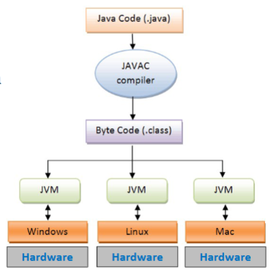

Here are your study notes, formatted for better readability and structure.

I've standardized the headings, cleaned up the indentation, formatted all code snippets using Java syntax highlighting, and bolded key terms to make them easier to find.

-----

# Chapter 1:

## 1\. What is Java?

  * One of the most popular software development languages
  * **High-level**, **Object-Oriented Programming (OOP)** language

## History

  * **1991:**
      * Java was called **Greentalk** by James Gosling (`.gt`).
      * It was then named **Oak**, as a part of the **Green project**.
      * It used C/C++ style syntax (for familiarity).
      * It was intended for handling portable devices and set-top boxes.
      * \-\> This initial project was a failure.
  * **1995:**
      * Sun Microsystems changed the name to **Java**.
      * Sun modified the language to take advantage of the developing World Wide Web (WWW).
      * Coined the term ***WORA***: **Write Once, Run Anywhere**.
      * Provided no-cost run-times on popular platforms.
  * **2009:**
      * **Oracle Corporation** acquired Sun Microsystems and took ownership of three key Sun software assets: Java, MySQL, and Solaris.

## Java Programming Environment

Here is the basic compilation and execution flow:


## Java Development Kit (JDK)

  * A superset of a **JRE** (Java Runtime Environment).
  * Contains tools for developing Java applications, e.g., the `javac` compiler.

## Java Runtime Environment (JRE)

  * The software package that contains what is required to *run* a Java program.
  * **JRE** = **JVM** (Java Virtual Machine) + **Java Class Libraries**.

## Java Virtual Machine (JVM)

  * A virtual machine that enables a computer to run Java programs, as well as programs written in other languages that are also compiled to Java bytecode.
  * The JVM:
      * Loads code
      * Verifies code
      * Executes code
      * Provides the runtime environment



## OOP: Core Concepts (Object & Class)

  * **Object:**

      * An instance of a class.
      * It inherits all the variables and methods from the class.
      * An entity with **state**, **behavior**, and **identity**.
      * **Physical (tangible):**
          * e.g. person, chair, bike, marker, table
      * **Logical (intangible):**
          * e.g. banking system, human resource management system
      * **Syntax to create an object:**
        ```java
        ClassName referenceVariable = new ClassName();
        ```
      * **To create an object:**
        1.  Define a class describing the common `features` (`states`) of all objects in that classification.
        2.  Declare the object with the defined class.

  * **Class:**

      * A **template** or **blueprint** from which objects are created.
      * Determines how an object will behave and what the object will contain.
      * **Syntax:**
        ```java
        class <class_name> {
            // states = (instance-)variables = features = data = attribute
            fields;

            // behaviors = code
            methods;
        }
        // Object = Instance
        ```

## C - Procedural Programming Language

  * Based on writing `functions` that perform operations on data.
  * Programs get `larger` in time as more functions are created.
      * This makes it **harder to manage** and maintain the code in a huge pile of functions.
      * Reusing the code is **limited** (you can reuse common functions, but you cannot easily modify them when reusing).

## Java - OOP Programming Language

  * OOP is at the core.
  * Based on creating objects that contain both `data` (or `states`) and `methods` (or `behaviors`).
  * **Pros:**
      * Provides a **clear structure** for programs.
      * **DRY** - "Don't Repeat Yourself".
      * **Easier to maintain, modify, and debug**.
      * Possible to create full **reusable applications** with less code and shorter development time.

## Java Interpreter

The flow from code to execution:

```text
[Java Program] -> [Compiler] -> [Java Bytecode Program] -> [Java Interpreter (Mac, Win, Linux)]
```

## Features of Java

  * Simple, Familiar, OOP
  * Robust, Secure
  * Architecture-neutral, Portable
  * Interpreted, Multithreaded, Dynamic
  * High Performance
  * Distributed

## Applications

  * Desktop GUI
  * Mobiles
  * Embedded Systems
  * Web Applications
  * Application Servers
  * Web Servers
  * Applications for Enterprises
  * Scientific Applications
  * Big Data Technologies
  * Business Applications

## Anatomy

### 1\. Block

  * A pair of braces `{}`.
  * Groups components of a program.

### 2\. Statement

  * An action or sequence of actions that ends with a semicolon `;`.

### 3\. Comment

  * **Single-line:** `//`
  * **Multi-line:** `/* */`

### 4\. Class

  * The essential Java construct.
  * A template or blueprint for objects.

### 5\. Package

  * Used to group related classes.
  * Example:
    ```java
    package <name>;
    public class Simple {}
    ```
  * Compiling the source code in `Simple.java` creates `Simple.class`, which is stored in a folder matching the package `<name>`.

### 6\. Reserved Words (Keywords)

  * Words that have a specific meaning to the compiler.
  * Cannot be used for other purposes (e.g., as variable names).
  * **Examples:** `class`, `public`, `static`, `void`.
  * **Hierarchy:**
      * **Reserved words (53)**
          * **Keywords (50)**
              * **Used Keywords (48)** (e.g., `if`, `else`, `for`, `while`...)
              * **Unused Keywords (2)** (`const`, `goto`)
          * **Reserved Literals (3)** (`true`, `false`, `null`)

### 7\. Modifiers

  * Certain reserved words that specify the `properties` of `data`, `methods`, and `classes` and how they can be used.

| Access Modifiers | Non-Access Modifiers |
| :--- | :--- |
| `private` | `static` |
| `default` (no mod) | `final` |
| `protected` | `abstract` |
| `public` | `synchronized` |
| | `transient` |
| | `volatile` |
| | `strictfp` |

### 8-9. Method & Main Method

  * Controls the program's flow.
  * A Java application is executed by invoking the `main` method.
  * A Java project can have multiple classes, but only **one** class can have the `main` method that acts as the program's entry point.

## OOP: Principles

### 1\. Two Paradigms

  * All computer programs consist of two elements: `code` and `data`.
  * Two models govern how a program is constructed:
    1.  **Process-oriented model:**
          * Code acting on data.
          * Becomes complex as programs grow larger.
    2.  **Object-oriented programming:**
          * Organizes a program around its data (`objects`) and a set of well-defined `interfaces` to that data.
          * Characterized as data controlling access to code.

### 2\. Abstraction

  * Shows only **essential attributes**.
  * **Hides unnecessary internal implementation details**.
  * Reduces programming complexity and effort.
  * `Hierarchical classifications` can help manage abstraction powerfully.

### 3\. The Three OOP Principles

#### Encapsulation

  * The mechanism that **binds together code** and the **data it manipulates**.
  * Keeps `both safe` from outside interference and misuse.
  * Ensures that `sensitive data is hidden`.
  * **You must:**
      * Declare variables/attributes as `private`.
      * Provide public `get` and `set` methods to access & update the value of a private variable.

#### Inheritance

  * The process where one class **inherits (acquires) attributes and methods** from another class.
  * Creates a hierarchical classification.
      * `subclass` (child): the class that inherits from another class.
      * `superclass` (parent): the class being inherited from.
  * Inheritance interacts with encapsulation.
  * If a class encapsulates some attributes, any subclass will have the same attributes *plus* any that it adds as part of its specialization.

#### Polymorphism

  * Means "one interface, multiple methods."
  * Allows a generic interface to be used for a group of related activities.
  * Reduces complexity by allowing the same interface to be used to specify a general class of action.
  * **Example:**
    ```java
    class Animal {
        public void animalSound() {
            System.out.println("The animal makes a sound");
        }
    }

    class Pig extends Animal {
        @Override
        public void animalSound() {
            System.out.println("The pig says: wee wee");
        }
    }

    class Main {
        public static void main(String[] args) {
            Animal myAnimal = new Animal();
            Animal myPig = new Pig(); // Upcasting

            myAnimal.animalSound(); // Output: "The animal makes a sound"
            myPig.animalSound();    // Output: "The pig says: wee wee"
        }
    }
    ```
  * **Stack Example:**
      * A program requires three types of stacks:
        1.  `st` Stack: integer
        2.  `nd` Stack: floating-point
        3.  `rd` Stack: characters
      * The algorithm implemented for each stack is the same, even though the data being stored differs.
      * **In a non-OOP language,** you would create three different sets of stack routines with different names.
      * **In Java (OOP),** you can specify a general set of stack routines that all share the same names (using polymorphism).

-----

# Chapter 2:

## Basic Output

  * `System` is a `final` class in the `java.lang` package.
  * `out` is a `static` member field of the `System` class, of type `PrintStream`.
  * `print()` and `println()` are methods of the `PrintStream` class.
  * `System.out.println(data);` // Prints data and adds a new line `\n`.
  * `System.out.print(data);` // Prints data and the cursor remains on the same line.
  * **Static fields** belong to the class, not instances of the class. All instances share the same static field.
  * **Non-static fields** (instance variables) can have different values for every object.

## Case-Sensitive

  * Java is case-sensitive.
  * `Main` is different from `main`.
  * `A` is different from `a`.
  * The name of the Java file **must** match the `public` class name.

## Identifier

  * A name given to a `package`, `class`, `interface`, `method`, or `variable`.
  * Allows a programmer to refer to the item from other places in the program.
  * **Rules:**
      * Includes letters (a-z, A-Z), digits (0-9), underscore (`_`), and dollar sign (`$`).
      * Letters and digits can be from the Unicode character set (e.g., Chinese, Japanese).
      * `Space` is not acceptable.
      * `Length` does not matter.
      * **Cannot** be a `keyword`, the `null literal`, or a `boolean literal` (`true`, `false`).
  * **Valid names:**
    ```text
    _variablename;
    _3variable;
    $testvariable;
    VariableTest;
    variableTest;
    this_is_a_variable_name_that_is_long_but_still_valid;
    max_value;
    ```
  * **Invalid names:**
    ```text
    8example;       // Cannot start with a digit
    exa+ple;        // + is not allowed
    variable test;  // Spaces are not allowed
    this-is-invalid; // Hyphens are not allowed
    ```

## Variables

  * Containers that hold a value while the Java program is executed.
  * All variables must be declared before they can be used.
  * **Syntax:**
    ```text
    data_type identifier [=value][, identifier [= value] ...];
    ```
      * `[]` means optional.
      * `identifier`: name of the variable.
      * `value`: initializer.

## Data Types

1.  **Primitive data types:**
      * `byte`, `short`, `int`, `long`, `float`, `double`, `boolean`, `char`
2.  **Non-primitive data types (Reference Types):**
      * `String`, Arrays, Classes

| Data Type | Size | Description |
| :--- | :--- | :--- |
| **byte** | 1 byte | Stores whole numbers from -128 to 127 |
| **short** | 2 bytes | Stores whole numbers from -32,768 to 32,767 |
| **int** | 4 bytes | Stores whole numbers from -2,147,483,648 to 2,147,483,647 |
| **long** | 8 bytes | Stores whole numbers from -9,223,372,036,854,775,808 to 9,223,372,036,854,775,807 |
| **float** | 4 bytes | Stores fractional numbers. Sufficient for 6 to 7 decimal digits |
| **double** | 8 bytes | Stores fractional numbers. Sufficient for 15 decimal digits |
| **boolean** | 1 bit | Stores `true` or `false` values |
| **char** | 2 bytes | Stores a single character/letter or ASCII values |

  * Java is a **strongly typed language**. This is key to its safety and robustness.
  * Every variable has a type, every expression has a type, and every type is strictly defined.
  * All assignments are checked for **type compatibility** by the compiler.
  * There are **no automatic coercions** or conversions of *conflicting types* as in some languages.

## Character Literals

  * Visible ASCII characters can be entered directly inside single quotes: `a`, `z`, `@`.
  * For characters that are impossible to enter directly, use **escape sequences** (starting with `\`).

| Escape sequence | Description |
| :--- | :--- |
| `\ddd` | Octal Character (e.g., `\141` is 'a') |
| `\uxxxx` | Hexadecimal Unicode Character (e.g., `\u0061` is 'a') |
| `\'` | Single quote ' |
| `\"` | Double quotes " |
| `\\` | Backslash |
| `\r` | Carriage Return |
| `\n` | New Line (or Line Feed) |
| `\f` | Form Feed |
| `\t` | Tab |
| `\b` | Backspace |

  * **Example Output:**
    ```java
    System.out.println("This is before\fNow new line");
    System.out.println("TEXTBEFORE\rOverlap");
    System.out.println("12\b3");
    System.out.println("\"Hello the world!\"");
    ```
    ```text
    This is before
                      Now new line
    OverlapORE
    13
    "Hello the world!"
    ```

## Type Conversion & Casting

An **automatic type conversion** will take place if:

1.  The two types are compatible.
2.  The destination type is **larger** than the source type (a "widening conversion").

<!-- end list -->

  * **A. Numeric Compatibility:**
    `byte` → `short` → `int` → `long` → `float` → `double`
    `char` → `int`

  * **B. Reference Compatibility (Inheritance):**

    ```java
    class Animal {}
    class Dog extends Animal {}

    Animal a = new Dog(); // Automatic upcast (widening)
    Dog b = (Dog) a;     // Explicit downcast (narrowing)
    ```

  * **Example (Automatic Widening):**

    ```java
    // int > byte
    int i;
    byte b = 21;
    i = b; // OK

    // long > int
    long l;
    i = 54678;
    l = i; // OK
    ```

  * To create a conversion between two *compatible* types when automatic conversion isn't possible, you must use a **cast**.

  * A **cast** is an **explicit type conversion**. It's
    usually a **narrowing conversion**, forcing a larger value into a smaller type.

  * **Cast Syntax:**

    ```java
    (target-type) value;
    ```

  * **Example (Explicit Narrowing):**

    ```java
    int a = 257;
    byte b;
    b = (byte) a; // b is now 1 (257 % 256)
    ```

⚠️ **Notes:**

  * If the two types are **incompatible** (e.g., `String` → `int`), you **cannot** use a cast. You must use conversion methods:

    ```java
    int n = Integer.parseInt("123");
    double d = Double.valueOf("3.14");
    ```

  * You also cannot use conversion methods to cast between two *compatible* numeric types.

  * **C. Incompatible Data Types (Cannot cast directly):**

      * `String` ↔ `int` ❌ `error: incompatible types`
      * `boolean` ↔ `int` ❌
      * `String` ↔ `double` ❌
      * `Object` ↔ `int` ❌

  * **D. Method Overloading Conditions:**

      * `Integer.valueOf(int_or_String)`
      * `Double.valueOf(double_or_String)`
      * `Boolean.valueOf(boolean_or_String)`
      * **Errors:**
          * `Integer.valueOf("3.14");` // ❌ `NumberFormatException`
          * `(int) Double.valueOf("3.14");` // ❌ `error: incompatible types` (must use `Double.parseDouble()`)
          * `(double) "3.14";` // ❌ `error: incompatible types`

  * **Casting Example Code:**

    ```java
    public class Conversion {
        public static void main(String[] args) {
            byte b;
            int i = 257;
            double d = 323.142;

            System.out.println("Int -> byte:");
            b = (byte) i;
            // 257 % 256 = 1
            System.out.println("i -> b: 257 -> " + b); // 1

            System.out.println("Double -> int:");
            i = (int) d; // Truncates decimal
            System.out.println("d -> i: 323.142 -> " + i); // 323

            System.out.println("Double -> byte:");
            b = (byte) d;
            // (byte) 323.142 -> (int) 323 -> (byte) 323
            // 323 % 256 = 67
            System.out.println("d -> b: 323.142 -> " + b); // 67
        }
    }
    ```

## Basic Input

  * Use the `Scanner` class: `import java.util.Scanner;`
  * Create an instance: `Scanner sc = new Scanner(System.in);`
  * `System.in` is the standard input stream.

| Method | Input Type Read |
| :--- | :--- |
| `int nextInt()` | integer |
| `float nextFloat()` | float |
| `double nextDouble()` | double |
| `byte nextByte()` | byte |
| `String nextLine()` | string (full line) |
| `String next()` | string (single word, stops at space) |
| `boolean nextBoolean()` | boolean |
| `long nextLong()` | long |
| `short nextShort()` | short |
| `BigInteger nextBigInteger()` | BigInteger |
| `BigDecimal nextBigDecimal()` | BigDecimal |

```java
import java.util.Scanner;

class BasicInput {
    public static void main (String args[]) {
        Scanner sc = new Scanner(System.in);
        
        System.out.print("Enter a full line: ");
        String s = sc.nextLine();
        
        System.out.print("Enter an integer: ");
        int i = sc.nextInt();

        // Must consume the leftover newline character after nextInt()
        sc.nextLine(); 

        System.out.print("Enter another line (or integer): ");
        // Using valueOf to convert from a String
        int n = Integer.valueOf(sc.nextLine());
        
        System.out.print("Enter a float: ");
        float f = sc.nextFloat();

        sc.close(); // Always close the scanner
    }
}
```

## Operators

### A. Arithmetic Operators

  * `+`, `-`, `*`, `/`, `%` (Modulus)

  * `++` (Increment), `--` (Decrement)

  * `+=`, `-=`, `*=`, `/=`, `%=` (Compound assignment)

  * **Increment/Decrement Example:**

    ```java
    public class IncDec {
        public static void main(String[] args) {
            int a = 1;
            int b = 2;
            int c;
            int d;

            // c = ++b;
            // b becomes 3, then c is assigned 3
            c = ++b; // c = 3, b = 3

            // d = a++;
            // d is assigned 1, then a becomes 2
            d = a++; // d = 1, a = 2

            c++; // c becomes 4
        }
    }
    ```

### B. Relational Operators

  * `==` (Equal to)
  * `!=` (Not equal to)
  * `>` (Greater than)
  * `<` (Less than)
  * `>=` (Greater than or equal to)
  * `<=` (Less than or equal to)
  * The outcome is always a **boolean** (`true` or `false`).
  * **Note:**
      * For `int done;`
          * `if (done == 0)` (Correct)
          * `if (done)` (Wrong - `int` is not `boolean`)
      * For `boolean done;`
          * `if (done)` or `if (!done)` (Correct)

### C. Logical Operators

  * **Logical (Short-circuit):** `&&` (AND), `||` (OR)

  * **Boolean/Bitwise:** `&` (AND), `|` (OR), `^` (XOR)

  * **Unary:** `!` (NOT)

  * **Ternary:** `?:`

  * **Assignment:** `&=`, `|=`, `^=`

  * **Summary Table (Vietnamese):**
    | Operator | Tên | Ý nghĩa |
    | :---: | :--- | :--- |
    | `&&` | Short-circuit AND | `true` nếu **cả hai** đều `true`. (Có ngắt mạch) |
    | `\|\|` | Short-circuit OR | `true` nếu **một trong hai** là `true`. (Có ngắt mạch) |
    | `!` | NOT Logic | Lật ngược `true` thành `false` và ngược lại. |
    | `&` | AND Bitwise | So sánh từng bit (`1 & 1 = 1`). |
    | `\|` | OR Bitwise | So sánh từng bit (`1 \| 0 = 1`). |
    | `^` | XOR Bitwise | So sánh từng bit (`1 ^ 0 = 1`). |
    | `==` | So sánh bằng | Kiểm tra xem hai giá trị có bằng nhau không. |
    | `!=` | So sánh khác | Kiểm tra xem hai giá trị có khác nhau không. |
    | `&=` | Gán AND | `a = a & b` |
    | `\|=` | Gán OR | `a = a \| b` |
    | `^=` | Gán XOR | `a = a ^ b` |
    | `?:` | Ba ngôi | `if-else` rút gọn. `(điều kiện ? đúng : sai)` |

  * **Truth Table:**
    | A | B | A | B | A & B | A ^ B | \!A |
    | :--- | :--- | :--- | :--- | :--- | :--- |
    | False | False | False | False | False | True |
    | True | False | True | False | True | False |
    | False | True | True | False | True | True |
    | True | True | True | True | False | False |

  * **Boolean Logic Example:**

    ```java
    public class BoolLogic {
        public static void main(String[] args) {
            boolean a = true;
            boolean b = false;
            boolean c = a | b; // c = true
            boolean d = a & b; // d = false
            boolean e = a ^ b; // e = true
            boolean f = (!a & b) | (a & !b); // f = true (same as XOR)
            boolean g = !a; // g = false
        }
    }
    ```

  * **Short-circuit Logical Operators (`&&`, `||`):**

      * Java will **only** evaluate the right-hand side if it's necessary to determine the result.

    <!-- end list -->

    ```java
    // The (2 / 0) part is never run, so no error occurs.
    if (false && (2 / 0 > 10)) { ... } // if(false)
    if (true  || (2 / 0 > 10)) { ... } // if(true)
    ```

  * **Bitwise/Boolean Logical Operators (`&`, `|`):**

      * Java **always** evaluates both sides.

    <!-- end list -->

    ```java
    // Both sides are run, so (2 / 0) causes an ArithmeticException.
    if (false & (2 / 0 > 10)) { ... } // error
    if (true  | (2 / 0 > 10)) { ... } // error
    ```

      * These can also be used for bitwise calculations on numbers:

    <!-- end list -->

    ```text
    Bitwise AND &
      5 (0101)
    & 3 (0011)
    ----------
      1 (0001)  // result = 1

    Bitwise OR |
      5 (0101)
    | 3 (0011)
    ----------
      7 (0111)  // result = 7
    ```

### D. Assignment Operators

  * `x = y = z = 100;`
  * Chain of assignment is allowed.
  * Evaluation happens from **right to left** (`z` gets 100, then `y`, then `x`).

### E. ? (Ternary) Operator

  * A shortcut for an `if-then-else` statement.
  * **Syntax:**
    ```java
    variable = expression1 ? expression2 : expression3;
    ```
  * If `expression1` is `true`, `variable` is assigned `expression2`.
  * If `expression1` is `false`, `variable` is assigned `expression3`.
  * `expression2` and `expression3` must be of compatible data types.

## Operator Precedence

| Precedence | Operator | Description | Associativity |
| :--- | :--- | :--- | :--- |
| **Highest** | `[]`, `()`, `.` | Array access, method call, member access | Left-to-right |
| | `++`, `--` | Postfix increment/decrement | |
| | `++`, `--`, `~`, `!`, `+`, `-` | Prefix inc/dec, bitwise NOT, logical NOT, unary plus/minus | Right-to-left |
| | `(type-cast)` | Cast | |
| | `*`, `/`, `%` | Multiplicative | Left-to-right |
| | `+`, `-` | Additive | Left-to-right |
| | `>>`, `>>>`, `<<` | Bitwise shift | Left-to-right |
| | `>`, `>=`, `<`, `<=`, `instanceof` | Relational, type comparison | Left-to-right |
| | `==`, `!=` | Equality | Left-to-right |
| | `&` | Bitwise AND | Left-to-right |
| | `^` | Bitwise XOR | Left-to-right |
| | `\|` | Bitwise OR | Left-to-right |
| | `&&` | Logical AND | Left-to-right |
| | `\|\|` | Logical OR | Left-to-right |
| | `?:` | Ternary | Right-to-left |
| | `->` | Lambda arrow | |
| **Lowest** | `=`, `op=` | Assignment (e.g., `*=`, `+=`, `%=`) | Right-to-left |

  * `instanceof` tests if an object is an instance of a specified type (class, subclass, or interface).

  * **Precedence Example:**

    ```java
    class Precedence {
        public static void main (String[] args) {
            int a = 10, b = 5, c = 1, result;
            result = a - ++c - ++b;
            /*
             Prefix operators ++c and ++b have higher precedence than -
             Evaluation (left-to-right for -):
             1. ++c -> c becomes 2
             2. ++b -> b becomes 6
             3. a - 2 -> 10 - 2 = 8
             4. 8 - 6 -> 2
             result = 2
            */
            System.out.println(result); // 2
        }
    }
    ```

-----

# Chapter 3:

## Control Statements

### Selection statements: if, switch

  * **If:** A conditional branch statement.

    ```java
    if (condition) {
        // multi-line block
    } else if (condition2) {
        // multi-line block
    } else {
        // multi-line block
    }

    // Single-line (braces optional)
    if (condition)
        statement;
    else
        statement;
    ```

  * **Nested If:** An `else` always refers to the *nearest* `if` statement within the same block that is not already associated with an `else`.

  * **Switch:** A multiway branch statement.

  * A better alternative than a large series of `if-else if`.

  * The `default` statement is optional. If no `case` matches and no `default` exists, no action is taken.

    ```java
    switch (expression) {
        case value1:
            // statements
            break; // Exits the switch
        case value2:
            // statements
            break;
        case valueN:
            // statements
            break;
        default:
            // default statements
    }
    ```

### Iteration statements

#### 1\. While

  * **Syntax:**
    ```java
    while (condition) {
        // loop body
    }
    ```
  * The `condition` (any boolean expression) is checked at the **top** of the loop.
  * The body executes as long as the condition is `true`.
  * The body of a `while` loop can be empty (a "null statement").
    ```java
    class NoBody {
        public static void main (String args[]) {
            int i = 100, j = 200;

            // Find midpoint
            while (++i < --j); // No body

            System.out.println("Mid point: " + i); // 150
        }
    }
    ```

#### 2\. Do-While

  * Always **executes its body at least once**.
  * The conditional expression is at the **bottom** of the loop.
    ```java
    do {
        // body
    } while (condition);
    ```
  * **Example:**
    ```java
    class DoWhile {
        public static void main (String[] args) {
            int n = 10;
            
            // This loop prints 10 down to 1
            do {
                System.out.println("tick " + n);
                n--;
            } while (n > 0);

            // This loop prints 0, then n becomes -1, --n > 0 is false
            n = 0;
            do {
                 System.out.println("tick " + n);
            } while (--n > 0); // n becomes -1, loop stops
        }
    }
    ```

#### 3\. For

  * **Syntax:**

    ```java
    for (initialization; condition; iteration) {
        // body
    }
    ```

    1.  `initialization` is executed **only once** at the beginning.
    2.  `condition` (boolean) is checked. If `true`, the body executes.
    3.  `iteration` (e.g., `i++`) is executed *after* the body.
    4.  Repeat from step 2 until the `condition` is `false`.

  * **Example (Prime Number Check):**

    ```java
    int num = 14;
    boolean isPrime = true;

    if (num < 2) {
        isPrime = false;
    } else {
        // Loop from 2 up to num/2
        for (int i = 2; i <= num / 2; i++) {
            if ((num % i) == 0) {
                isPrime = false;
                break; // Exit loop early
            }
        }
    }
    // return isPrime;
    ```

  * **Using commas** to include multiple statements in `initialization` or `iteration`:

    ```java
    int a, b;
    // Loop runs for a=1,b=4 and a=2,b=3. Stops when a=3,b=2
    for (a = 1, b = 4; a < b; a++, b--) {
        // body
    }
    ```

  * Parts of the `for` loop can be empty:

    ```java
    int i = 0;
    boolean done = false;
    // Missing initialization and iteration
    for ( ; !done; ) {
        if (i == 10) done = true;
        i++;
    }

    // Infinite loop
    for ( ; ; ) {
        // body
    }
    ```

#### 4\. For-each (Enhanced For Loop)

  * Used to iterate over collections (like arrays).
  * **Syntax:**
    ```java
    for (type iterationVariable : collection) {
        statement-block
    }
    ```
  * The `iterationVariable` receives each element from the collection, one at a time, from beginning to end.
  * The for-each loop is essentially **read-only**. Modifying the iteration variable does *not* change the original array.
    ```java
    int nums[] = {1, 2, 3, 4};
    for (int x : nums) {
        x = x * 10; // This does NOT affect the elements in nums[]
    }
    ```

#### 5\. Iterating Over Multidimensional Arrays

```java
int sum = 0;
int m = 5, n = 10;
int nums[][] = new int[m][n];

// Using a traditional for loop to WRITE data
for (int i = 0; i < m; i++) {
    for (int j = 0; j < n; j++) {
        nums[i][j] = (i + 1) * (j + 1); // This affects the array
    }
}

// Using a for-each loop to READ data
for (int x[] : nums) { // x is a 1D array (a row)
    for (int y : x) {  // y is an int (a cell)
        y = 1;       // This does NOT affect the array
        sum += y;    // This works fine
    }
}
```

### Jump statements

  * `break`, `continue`, `return`

#### 1\. Break

  * Terminates a `switch`, `for`, `while`, or `do-while` loop.
  * Program control continues at the next statement *outside* the loop.
    ```java
    for (int i = 0; i < 100; i++) {
        if (i == 10)
            break; // Loop stops here
        System.out.println("i: " + i); // Prints 0 through 9
    }
    // System.out.println("i = " + i); // Error: i is out of scope
    ```
  * **Using a Label with `break`:**
      * `break` can be used to exit a specific *labeled* block of code.
    <!-- end list -->
    ```java
    first: {
        second: {
            third: {
                System.out.println("Before the break.");
                if (true)
                    break second; // Jumps to end of 'second' block
                System.out.println("Not executed.");
            }
            System.out.println("Not executed also.");
        } // break jumps here
        System.out.println("This will be executed.");
    }
    ```
  * You **cannot** `break` to a label that is not enclosing the `break` statement.
    ```java
    one: for (int i = 0; i < 3; i++) {
        // body of 'one'
    }

    for (int j = 0; j < 3; j++) {
        if (true)
            break one; // WRONG! 'one' does not enclose this loop.
    }
    ```

#### 2\. Continue

  * Forces the next iteration of the loop to take place, skipping any code in between.

  * In `while` and `do-while` loops, control goes directly to the `conditional expression`.

  * In a `for` loop, control goes to the `iteration` step, then the `conditional expression`.

  * **Using a Label with `continue`:**

      * `continue` can be used to restart a specific *labeled* loop.

    <!-- end list -->

    ```java
    outer: for(int i = 0; i < 10; i++) {
        for (int j = 0; j < 10; j++) {
            if (j > i) {
                System.out.println();
                continue outer; // Stops inner loop, starts next 'i' iteration
            }
            System.out.print(" " + i + "," + j);
        }
        System.out.println(); // This line is skipped by 'continue outer'
    }
    ```

      * **Output:**

    <!-- end list -->

    ```text
     0,0
     1,0 1,1
     2,0 2,1 2,2
     3,0 3,1 3,2 3,3
     ...
     9,0 9,1 9,2 9,3 9,4 9,5 9,6 9,7 9,8 9,9
    ```

#### 3\. Return

  * Immediately terminates the **method** in which it is executed.
  * Control returns to the caller of the method.
    ```java
    if (true)
        return; // Program execution stops here

    System.out.println("This won't execute");
    ```

### Array

  * A group of **like-typed** variables that are referred to by a common name.
  * An array of any type can be created and may have multiple dimensions.
  * A specific element is accessed by its **index** (starting from `0`).

#### 1\. One-dimension

  * **Declaration:** `type var-name[];`
      * This only declares `var-name` as an array variable; no array exists yet.
  * **Allocation:** You must allocate memory using `new`.
    ```java
    type var-name[] = new type[size];
    ```
  * Elements are automatically initialized to `0` (numeric), `false` (boolean), or `null` (reference types).
  * Access elements using `var-name[index]`.

#### 2\. Multidimensional Arrays

  * These are **arrays of arrays**.
  * `type var-name[][] = new type[rows][cols];`
  * When allocating, you only *need* to specify the first (leftmost) dimension. You can allocate the remaining dimensions separately. This allows for **jagged arrays** (where each row has a different length).
    ```java
    // Create a jagged array
    int twoD[][] = new int[4][];
    twoD[0] = new int[1];
    twoD[1] = new int[2];
    twoD[2] = new int[3];
    twoD[3] = new int[4];

    int i, j, k = 0;
    for (i = 0; i < 4; i++) {
        for (j = 0; j < i + 1; j++) {
            twoD[i][j] = k++;
        }
    }
    ```
      * **Resulting array:**
    <!-- end list -->
    ```text
    0
    1 2
    3 4 5
    6 7 8 9
    ```
      * Note: `new int[0]` is valid and creates an empty array.
    <!-- end list -->
    ```java
    int twoD[][] = new int[1][];
    twoD[0] = new int[0];
    System.out.println(twoD[0]); // Prints array's object reference
    ```

#### 3\. Initialize Multidimensional Arrays

  * You can use an initializer list:
    ```java
    double m[][] = {
        {0, 1, 2, 3},
        {0, 1, 2, 3},
        {0, 1, 2, 3},
        {0, 1, 2, 3}
    };
    ```

### String

  * `String` is a non-primitive type (a class).
  * `String str = "this is a test";`
  * You can also declare arrays of strings:
    `String[] s = new String[3];`

| Method | Description | Return Type |
| :--- | :--- | :--- |
| `charAt(index)` | Returns the character at the specified index. | `char` |
| `concat(str)` or `+` | Appends a string to the end of another string. | `String` |
| `contains(seq)` | Checks whether a string contains a sequence of characters. | `boolean` |
| `indexOf(str)` | Returns the position of the *first* occurrence of specified characters. | `int` |
| `isEmpty()` | Checks whether a string is empty (`length() == 0`). | `boolean` |
| `length()` | Returns the length of a specified string. | `int` |
| `replace(old, new)` | Returns a new string where specified values are replaced. | `String` |
| `toLowerCase()` | Converts a string to lower case letters. | `String` |
| `toUpperCase()` | Converts a string to upper case letters. | `String` |
| `trim()` | Removes whitespace from both ends of a string. | `String` |
| `substring(begin, end)` | Returns a substring from `begin` (inclusive) to `end` (exclusive). | `String` |
| `substring(begin)` | Returns a substring from `begin` (inclusive) to the end. | `String` |

# Chapter 4:

## Class
- Defines a new data type
- Logical construct
- Methods and variables defined within a class are called members of the class
- Instance variables are acted upon and accessed by the methods defined for the class
- Template or blueprint from which objects are created
- Basic concept of OOP which revolve around the real-life entities
- Determine how an object will behave and what the object will contain

## Object
- Physcial reality
- Instance of a class
- `Data` for one object is separate and unique from the data for another
- Most `methods` will not be specified as `static` or `public`
- Inherit all the `variables` and `methods` from the class
- An entity that has `state` and `behavior`
- Physical (tangile) or logical (intangible)

### Declaring Objects
- The `new` operator dynamically allocates memory for an object and returns a reference -> it.
- `Reference`: address in memory of the object, stored in the variable


### Assigning Object Reference Variables
```java
Box b1 = new Box();
Box b2 = b1;
```
](<Assigning Object.png>)

```java
Box b1 = new Box();
Box b2 = b1;
b1 = null
```
](<Assigning Only One Object.png>)

### Variable/Method Access
- Every Box object contains `its own copies` of the instance variables `width`, `height`, and `depth`
- To access these variables or methods, use the dot (.) operator.
- `.` links the name of the object with name of an instance variable/method

- Call the file that contains this program BoxDemo.java, because the main() method is in the class BoxDemo (not the class called Box)
- When compiling this program, you will find that two .class files have been created, one for Box and one for BoxDemo
- The Java compiler automatically puts each class into its own .class file. It is not necessary for both the Box and the BoxDemo class to be in the same source file.
- Each class is in different file, called `Box.java` and `BoxDemo.java`

## Method
- General form:
```java
type name(parameter-list) {
  // body of method
  type value;
  // ...
  return value; // void method doesn't have this
}
```
- Used to access the instance variables defined by the `class`
- `type` specifies the `type` of data returned by the method
- This can be any valid type, including `class` types that you create
- If the method does not return a value, its return type must be `void`
- The `type` of data returned by a method `must be compatible` with the return type specified by the method
  - Example: if the return type of some method is `boolean`, you could not return an `integer`
- The `variable` receiving the value returned by a method must also be compatibe with the `return type` specified for the method

### Parameters:
- A variable defined by a method that receives a value when the method is called.
  - Example: square(int i), i is a parameter
- An `argument` is a value that is passed to a method when it is invoked
  - Example: square(100) passes `100` as an argument

## Constructors:
- Initializes an object immediately upon creation
- Has the same name as the class in which it resdes and is syntactically similar to a method
- Once defined, the constructor is automatically called when the object is created, before the new operator completes
- Has `no return type`, not even void, since the implicit return type of a class' constructor is the class type itself.
- Initialize the `internal state` of an object -> that the code creating an instance will have a fully initialized, usable object immediately

### Paramterized Constructors
- The Box() constructor initializes all boxes with the `same predetermined` dimensions
-> Each object can be initialized by specifuing in the parameters to its constructor
```java
Box(double w, double h, double d) {
  width = w;
  height = h;
  depth = d;
}
```

## `This`
- `this` can be used inside any method to refer to the current object on which the method was invoked
- The use of `this` is redundant but correct
```java
Box (double width, double height, double depth) {
  this.width = width;
  this.height = height;
  this.depth = depth;
}
```
### Instance Variable Hiding
- It's illegal in Java to declare two local variables with the same name `inside the same or enclosing scopes`
- A local variable has the same name as an instance variable, the local variable `hides` the instance variable
=> Uses `this` to access the instance variables

## Garbade Collection
- Java handles `deallocation` for you `automatically`
- Why? Java runtime env has a garbage collector that periodically frees the memory used by objets that are no longer referenced

## Stack Class
- Stack stores FILO, first-in, last-out ordering

```java
class Stack {
  int stck[] = new int[10];
  int top;

  Stack() {
    top = -1;
  }

  void push(int item) {
    if (top == 9) { // Stack up to ten integers
      System.out.println("Stack is full.");
    } else {
      stck[++top] = item;
    }
  }

  int pop() {
    if (top < 0) {
      System.out.println("Stack underflow.");
      return top;
    } else {
      return stck[top--]; // top is acting like a counter;
      // the actual value in stack is not deleted
      // but it will be replaced on the next time we stack
    }
  }
}
```

## Overloading Methods
- 2 or more methods within the same class the share the same name
- But their parameter declarations are different

- Polymorphism
- Must differ in the `type` and/or `number` of parameters
- The `return type` alone is `insufficient` to distinguish two versions of a method
- Java simply executes the version of the method whose parameters match the arguments used in the call
- Java uses the `type` and/or `number` of arguments as its guide to `determine` which version of the overloaded method to actually call.

```java
class OverloadingDemo {
  void test() {
    System.out.println("No parameters");
  }

  void test(int a) {
    System.out.println("a: " + a);
  }

  void test(int a, int b) {
    System.out.println("a and b: " a + " " + b);
  }

  void test(double a) {
    System.out.println("double a: " + a);
    return a * a;
  }
}

public class Overload {
  public static void main(String[] args) {
    OverloadDemo ob = new OverloadDemo();
    double result;

    ob.test();  // "No parameters"
    ob.test(10);  // a: 10
    ob.test(10, 20);  // a and b: 10 20
    result = ob.test(123.25); // double a: 123.25
    System.out.println(result); // 15190.5625
  }
}
```

* But Java will employ its automatic type conversions iff no exact match is found

```java
short i = 88;
ob.test(i); // a: 88 (short -> int)
```

## Use Objects as Parameters

```java
class Box2 {
  double width;
  double height;
  double depth;

  Box2(Box2 ob) {
    this.width = ob.width;
    this.height = ob.height;
    this.depth = ob.depth;
  }

  Box2(double w, double h, double d) {
    this.width = w;    
    this.height = h;
    this.depth = d;
  }

  Box2() {
    width = -1;
    height = -1;
    depth = -1;
  }

  Box2(double len) {
    width = height = depth = len;
  }
}

public class OverloadCons {
  public static void main(String[] args) {
    Box2 mybox1 = new Box2(10, 20, 15);
    Box2 mybox2 = new Box2();
    Box2 mycube = new Box2(7);
    Box2 myclone = new Box2(mybox1);
    // myclone has all mybox1 attributes
  }
}
```

## Argument Passing
1. call-by-value:
* copies the value of an argument -> formal parameter of the subroutine
* changes made to the paramteter of the subroutine have no effect on the argument

2. call-by-reference:
* a reference to an argument (not the value of the argument) is passed -> parameter
* changes made -> parameter will affect the argument used to call the subroutine

When a primitive type is passed -> emthod, it is passed by value.
When objects are passed to a method, it is passed by reference

```java
class Test {
  int a, b;

  Test(int i, int j) {
    a = i;
    b = j;
  }

  void meth(Test o) {
    o.a *= 2;
    o.b /= 2;
  }
}
```

## Access Control

- Encapsulation links data with the code that manipulates it
- Encapsulation provides another important attribute: access control
- Control what parts of a program can access the members of a class
- Prevent misuse:

| Visibility                    | Public | Proctected | Default | Private |
| Same class                    | ok     | ok         | ok      | ok      |
| No same class, same package   | ok     | ok         | ok      | No      |
| Sub class, same package       | ok     | ok         | ok      | No      |
| Sub class, outside package    | ok     | ok, inheritance| No  | No      |
| Non-sub class, outside package| ok     | No         | No      | No      |

Public: ok all
Protected: only inheritance, same class and same package
Default: same class, same package
Private: same class

Why main() has always been preceded by the public modifier?
Main() is called by code that is outside the program

```java
class Test{
  int a;
  public int b; // ok all
  private int c; // inside class Test

  void setc(int i) {
    c = i;
  }

  int getc() {
    return c;
  }
}

public class AccessTest {
  public static void main(String[] args) {
    Test ob = new Test();
    ob.a = 10; // ok, default, same package
    ob.b = 20; // super ok, public, ok all
    ob.c = 100; // error, private

    ob.setc(100); // ok, through method
    System.out.println(ob.a + ob.b + ob.getc())
  }
}
```

## `static`
- global variables
- all instances of the class share the same `static variable`
- A `static block` that gets executed exactly once, when the class is first loaded
- `static methods`:
  - Can only directly call other `static methods` of their class
  - Can only directly access `static variables` of their class
  - Cannot refer to `this` or `super` in any way!

```java
public class UseStatic {
  static int b = 1;

  static void meth(int x) {
    System.out.println(x); // you can passed parameter
    System.out.println("b = " + b); // ok
  }

  static {
    System.out.println("This will be initialized 1st. And overiding the b = 1.");
    b = 1000;
  }

  static { // static block will run over the b = 1000
    b = 100;
    System.out.println("This will be initialized 2nd, but overide the 1st b = 1000.");
  }

  public static void main(String[] agrs) {
    meth(42);
  }

  /*
  Hi
  Static block initialized
  b = 100;
  */
}
```
```java
static {
  b = 1000;
}
static b = 1;
// b = 1
```
- Trong Java, static blocks có thể dùng biến static khai báo phía sau, vì trình biên dịch biết toàn bộ cấu trúc class. Nhưng thứ tự gán giá trị phụ thuộc vào vị trí trong file.
```java
static {
  b += 1000; // illegal forward reference
}
static b = 1;
```
- Java quy định:
* Một static block không thể sử dụng giá trị của biến static được khai báo sau block đó trong cùng lớp.
* Tuy nhiên, nó có thể gán giá trị cho biến đó — vì gán không yêu cầu đọc giá trị hiện tại.

```java
public class UseStatic {

  static int b = 1;

  static {
    System.out.println("How can b exist here?");
    System.out.println("Static: b = " + b);
    b = 100; // this will write on static, not create local
    System.out.println("Static: b = " + b); // b = 100
    int b = 1000; // but this will also be accepted, even var-name is b
    System.out.println("Static: b = " + b); // b = 1000
  }

  static void meth() {
    System.out.println("Meth: b = " + b); // b = 100
    int b = 999;
    System.out.println("Meth: b = " + b); // b = 999
  }

  public static void main(String[] agrs) {
    System.out.println("Main: b = " + b);
    meth();
  }
}
```

```java
class Student {
  int rollno;
  String name;
  static String college = "CSE";

  static void change() {
    college = "BBDIT"; // change here, if called
  }

  Student (int r, String n) {
    rollno = r; // assigning only, nothing special
    name = n;
  }

  void display() {
    System.out.println(rollno + name + college); // college may changed
  }
}

public class TestStaticMethod {
  public static void main(String args[]) {
    Student.change(); // --> college = BBDIT

    Student s1 = new ...

    s1.display(); // college will all be BBDIT
  }
}
```

Ouside of the class in which `static` are defined, `static methods` and `variables` can be used `independently of any object`.
- To do so, only specified the name of their `class` + .method()
Where `classname` is the name of the class in which the `static method` is declared.

```java
class StaticDemo {
  static int a = 42; // a = 42;
  static int b = 99; // b = 99;

  static void callme() {
    System.out.println(a);
  }
}

public class StaticByName {
  public static void main(String[] args) {
    StaticDemo.callme(); // a = 42; don't need to create any obj
    System.out.println(StaticDemo.b); // b = 99;
  }
}
```

## `final`
- Prevent its contents from being modified, making it, essentially, a `constant`
- Must initialized a final field when it is declared
  1. `Give it the value` when it is declared: (common way)
    E.g. final int FILE_NEW = 1;
  2. Assign it a value `within a constructor`

- It is a common coding convention to choose all `UPPERCASE IDENTIFIERS` for `final` fields
- Declaring a `final method parameter` prevents it from being changed within the method
- Declaring a `final local variable` prevents it from being assigned a value again.
- Final class cannot be inherited
- Final method cannot be modified

```java
class Bike9 {
  final int speedlimit = 90;

  void run() {
    speedlimit = 400; // error here
  }

  public static void main(String[] args) {
    Bike9 ob = new Bike9();
    ob.run();
  }
}
```
```java
class Bike {
  final void run() {
    System.out.println("running");
  }
}

class Honda extends Bike {
  void run() { // error, Cannot override the final method from Bike
    System.out.println("running safely");
  }

  public static void main(String[] args) {
    Honda honda = new Honda();
    honda.run();
  }
}
```

## Array Revisited
- Size of array:
```java
int a1[] = new int[10];
int a2[] = {1, 3, 5, 6};
a1.length;
a2.length;
```

## Nested & Innter Classes
- Nested class: A class is defined within another class
- Scope of nested class is bounded by the scope of its enclosing class
- Nested class has access to the members, including private members, of the class in which it is nested
- The enclosing class does not have access directly to the members of the nested class
- A nested class that is declared directly within its enclosing class scope is a member of its
